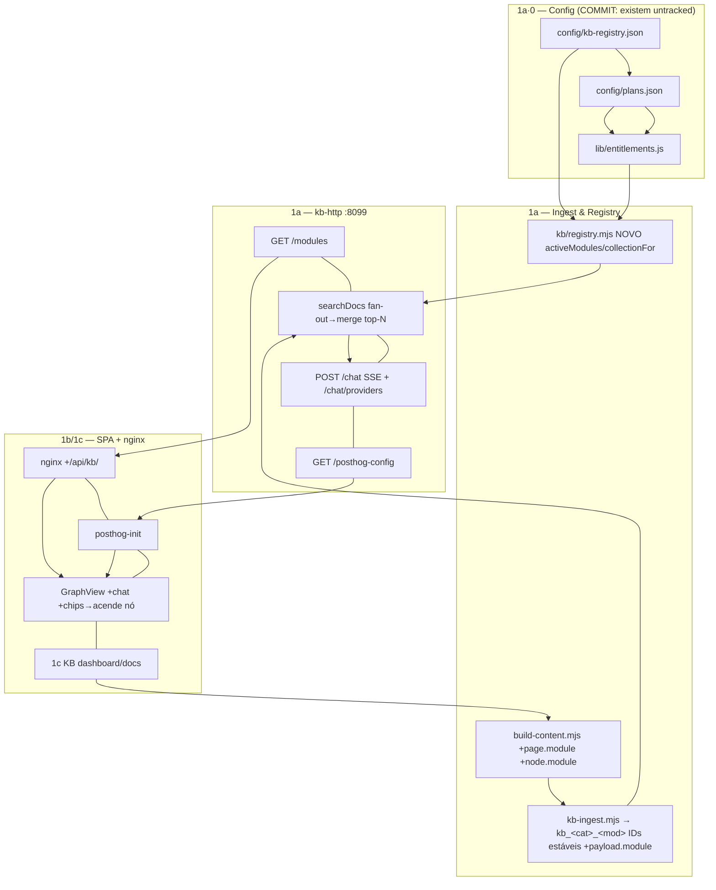

# NetProspect v2 — Docs-KB federada + programa de plataforma (plano UNIFICADO)

> **Na aprovação:** gravar este plano como `.claude/plans/todo/v2-platform-plan.md`; arquivar
> `.claude/plans/todo/phase6-store-stripe-portal-plan.md` → `.claude/plans/done/`.
> **Disciplina multi-sessão:** repo com sessões Claude concorrentes — re-verificar `git log` + `grep` dos
> símbolos **antes** de tocar cada ficheiro; commitar **só ficheiros meus**; footer Co-Authored-By +
> Claude-Session; confirmar convergência da frota (~5 min) após deploy.
> *Unificação de: plano local (auditoria + limpeza pré-v2 + reorg) + plano refinado do Ultraplan (Fase 1 técnica).*

---

## Context

Evoluir a "plataforma de docs" (F9a — design-system + Storybook, **feito**) para: (1) uma **KB federada e
modular** espelhada no futuro monorepo (cada dashboard/server/worker/script/agent/data-store/observability/
automation/AI/integration com a sua pasta+KB, federadas numa KB central) com **planos por cliente + limites de
utilização**; e (2) um **programa de plataforma v2** (TypeScript+TypeDoc, testes, CI, repo privado, rename
netprospect-v2, onboarding hel1-npm). **Sequenciamento: docs-KB primeiro; limpeza dos planos antigos em paralelo;
resto em fases.**

### Estado dos 3 config — RECONCILIADO (verificado neste container, 2026-07-20)

`config/kb-registry.json` (11 cats / **103 módulos**), `config/plans.json` (4 planos + 2 features exemplo
ai-credits/contacts-extracted), `lib/entitlements.js` (smoke-tested) — **EXISTEM no working tree desta sessão**
mas estão **UNTRACKED e NÃO em `origin/main`**. O clone cloud do Ultraplan (fresco de `main`) não os viu → daí
a sua "correção" (ambos certos). **Ação: Passo 0 = committar+pushar os 3 para `main`** (não "criar"). Se num
ambiente fresco faltarem, criar per a **taxonomia COMPLETA (103 módulos, ~20 active do mapa; resto `declared`/
`planned`)** — **NÃO reduzir a ~25**. Se surgirem por `git pull` (outra sessão), **reconciliar** (não sobrescrever).

### Backend RAG actual (verificado — reutilizar; gaps concretos a fechar na Fase 1)

- **Coleção única** `netprospect_docs` (`docs-site/mcp/tools.mjs:17`), **não** por-módulo; payload
  `{slug,title,type,idx,text}` **sem `module`**.
- `kb/qdrant.mjs`: `ensureCollection(name,dim)`, `upsert(name,points)`, **`search(name,vec,limit,filter)`**
  (já aceita `filter`), `count(name)` — cliente REST puro com retry. **Reutilizar tudo.**
- `scripts/kb-ingest.mjs`: **IDs posicionais** (`id:i+k`) → corrigir p/ IDs estáveis (hash `slug#idx`); payload
  sem `module`. `scripts/build-content.mjs`: `pages[]`/`nodes[]` **sem `module`**; embed local 384-dim.
- `lib/ollama.js`: **`ollamaGenerate` é `stream:false`** (não streama) → preciso de `ollamaStream` novo.
- `mcp/server.mjs`: só `/health /search /doc /related` — **sem `/modules`, `/chat`, `/chat/providers`,
  `/posthog-config`**. SPA `src/App.jsx`: `GraphView` (react-force-graph-2d) **sem chat, sem PostHog**.
  `deploy/docs/nginx.conf`: serve `/docs/`, **sem `/api/kb/`**. `captureAi` é **inline** em
  `dashboard/server.mjs:1664` (replicar num helper local).

### Decisões fechadas (utilizador)

- Taxonomia = `config/kb-registry.json` (hierárquica; módulo = pasta com `kb.json`/`docs/`).
- **Federação = coleção Qdrant `kb_<cat>_<mod>` por módulo** + adapters ao vivo onde aplicável.
  **Escape hatch** (se o fan-out for lento): coleção única + payload `module` + `filter` do `search()` existente.
- Multi-provider IA: `retrieval` (base) · `ollama` (flag-gated) · **CLIs externos** (precedência se houver keys;
  API key **E** auth por subscrição). **Chat = SSE por defeito; suportar ambos os modos.**
- Planos+limites: `config/plans.json` (acesso = flag PostHog; limite por período daily/weekly/monthly,
  `amount:null`=ilimitado). `lib/entitlements.js` resolve; metering liga depois.
- TypeScript: **migrar** JS→TS (fase posterior) + TypeDoc por pasta. Âmbito deste build: **Fase 1 (1a+1b+1c)**.

---

## FASE 1 — Docs-KB federada (BUILD AGORA) · o F9b-1

### 1a — Backend federado (verificável por curl, sem UI)

**Passo 0 — Committar os 3 config existentes p/ `main`** (working tree, untracked): `config/kb-registry.json`
(103 módulos; inclui `incidents` c/ sub-paths + `workers/gmb`), `config/plans.json`, `lib/entitlements.js`
(`planModules(profile)` expande `servers/*`/`@all`; `resolveLimit(profile,feature)`). *Se faltarem num ambiente
fresco, criar per a taxonomia completa.*

1. **`module:` por doc** — `docs-site/scripts/build-content.mjs`: carimbar `page.module` (frontmatter `module:`
   → senão tabela de mapeamento do Mapa dos 52 → default `core`) em `pages.map` (~L91) **e** `node.module` em
   `nodes.map` (~L101). Tabela = constante no topo.
2. **Ingest por-módulo** — `docs-site/scripts/kb-ingest.mjs`: `coll=collectionFor(p.module)`; agrupar chunks por
   coleção; `ensureCollection(coll,384)` 1×/coleção; `upsert(coll,points)`. **IDs estáveis:** `id: hashInt(`${slug}#${idx}`)`
   (não posicional); payload +`module`; log `count()` por coleção.
3. **Registry loader** — novo `docs-site/kb/registry.mjs`: lê o registry + `entitlements.planModules(DOCS_PROFILE)`
   → `activeModules()`, `collectionFor(module)`, `allCollections()`, expande wildcards; override por-módulo por
   flag PostHog `kb_module_<cat>_<mod>` (server-side).
4. **Search federado** — `docs-site/mcp/tools.mjs` `searchDocs(query,limit,profile)`: embed 1× → **fan-out**
   `search(coll,vec,limit)` sobre as coleções ativas → merge por `score` → top-N; hits tagged `module`.
   `mcp/server.mjs`: **`GET /modules`** (registry filtrado pelo perfil) + **`GET /posthog-config`**
   (`{enabled,key,host}` de env). *(Escape hatch se lento: coleção única + `filter`.)*
5. **Proxy `/api/kb/`** — `deploy/docs/nginx.conf`: `location /api/kb/ { proxy_pass http://kb-http:8099/; }`
   (docs-web+kb-http na rede `npdocs`). Prod: NPMplus também mapeia (snippet em `docs/runbook-npm-hel1.md`).

### 1b — Chat + UI (SSE por defeito, ambos os modos)

6. **`lib/ollama.js` — novo `ollamaStream(prompt,{model,onToken,…})`**: `/api/generate` `stream:true`, itera
   NDJSON → tokens via callback; devolve `{ok,text,promptTokens,outputTokens}`. Mantém `ollamaGenerate` p/ o
   modo não-streaming. Fail-soft.
7. **`/chat` (SSE) + `/chat/providers`** — `mcp/server.mjs`: `POST /chat` retrieve federado (Passo 4) → contexto
   → gera. `provider=retrieval|ollama`. **SSE** `text/event-stream`: `event: token|cite|done`. `retrieval` =
   extractos+citações sem LLM; `ollama` = `ollamaStream`. Replicar `captureAi`/`$ai_generation`
   (`dashboard/server.mjs:1664`) num helper local (env `POSTHOG_PUBLIC_KEY/HOST`). `GET /chat/providers`
   (v1: `retrieval` sempre; `ollama` se `DOCS_OLLAMA_ENABLED`+flag).
8. **PostHog no SPA** — `docs-site`: dep `posthog-js`, init de `/api/kb/posthog-config` (modelo
   `dashboard/public/posthog-init.js`: `onFeatureFlags`/`isFeatureEnabled`) → flags de módulo/feature + `$ai`.
9. **UI do chat no grafo** — `src/App.jsx` `GraphView`: painel de chat (componentes `src/ui/*`; resposta
   *streamed* SSE; **chips de citação por-módulo** → `#/<slug>` e **acendem o nó** via `nodeColor`/`highlightedIds`;
   seletor de modelo de `/chat/providers`; botão "Aprofundar no Open Notebook" (stub→Fase 3)).

### 1c — KB do docs-platform
10. Docs da própria mini-app (design-system, `src/ui`, Storybook, arquitectura) como `.md` sob `docs/` mapeados
    ao módulo **`dashboard/docs`** (active) → build-content → ingest → grafo.

**Verificação F1:** `deploy/docs/build.sh` (np-server, container node:20). Curl `GET /api/kb/{modules,
posthog-config}`, `GET /api/kb/search?q=&profile=`, `POST /api/kb/chat` (ver stream SSE), `GET
/api/kb/chat/providers`. Browser: chat no grafo, citações acendem nós, seletor de modelo, flags on/off módulos.
`node --check`; `node -e` smoke ao `entitlements.js`.

---

## FASE 0 — Limpeza pré-v2 (fechar os 4 planos antigos)  · track paralelo à Fase 1

3 agentes verificaram cada plano vs código. **Quase tudo feito**; deltas abaixo fecham antes do corte v2.
Ownership = **outras sessões** → coordenar (grep + `git log` + commit só ficheiros meus).

**Auditoria:**
- **reacher-coordinated-plan.md — ✅ COMPLETO** (d374db9/6d6b1b9/47f024b/0ea136f). Só falta o **opcional**
  `has_valid_corp_email`. Backfills feitos. Desvios intencionais.
- **moloni-crm-integration.md — ✅ ~95%.** Cliente/write/sync, schema, API read+write (docs cliente), páginas
  Contabilidade+PDF, Agendamentos (Notion+GCal ligados) feitos. **Gaps:** `lib/brevo.js`+`social/*`+`media/*`
  não criados (creds do user); escrita docs **fornecedor** não ligada; vista Agendamentos = tabela (talvez
  by-design); emissão só-API (sem form UI); comentário de cron `moloni-sync.js` diz "30 min" mas é diário 05:00.
- **client-portal.md (Fase 6) — ✅ backend; UI+hardening por fechar.** Loja multi-método, `/buy/:token`,
  `/portal/:token`, coleção `payments` feitos. **Gaps:** (a) **Moloni no fulfill = STUB** (`emitMoloniInvoice`
  console.log; `createDocument` real não é chamado — bloqueado por permissões Moloni sandbox); (b) **hardening
  webhooks** (PayPal assinatura+capture, CoinGate secret, EuPago validação)+sandbox; (c) **UI em falta**:
  "Vender" (API `/api/sell/:id` pronta), gerar/copiar link portal (API `/api/portal/:id/link` pronta),
  auto-email portal no `POST /api/clients/:id`; (d) URL portal nas observações da fatura Moloni.
- **docs-plan.md — ✅ F0–F6+F9a; F9b = este plano.** Gaps: F1 OpenAPI/Scalar (→ supersedido pela Fase 4 TS);
  custom-locations NPMplus pendentes (TODO-KEYS §3, ops); Docusaurus spike descartado; Pagefind→busca client+RAG.

**Tarefas de fecho:**
1. **Código puro (fazer já):** UI dashboard (Vender + link-portal + auto-email portal em `/api/clients`); escrita
   docs fornecedor Moloni (+opc. form); `has_valid_corp_email` (opc.); corrigir comentário cron `moloni-sync.js`.
2. **Bloqueado por creds/permissões:** Moloni no fulfill (ligar `createDocument`); hardening+sandbox dos webhooks;
   portar `lib/brevo.js`+`social/*`+`media/*` quando as keys existirem.

## Ficheiros deprecados / mortos (limpar no cleanup)
- **`lib/bank-transfer.js`** — órfão (0 importadores) + **mismatch env** (loja lê `STORE_IBAN`; `/api/config`
  verifica `BANK_TRANSFER_IBAN`). → unificar env e ligar, OU apagar (loja faz bank inline).
- **`lib/wise.js`** — órfão intencional (Wise off) → dormente ou apagar.
- **`emitMoloniInvoice` stub** (`dashboard/server.mjs:2831`) → ligar o real ou remover o seam.
- **`backfill-mail-provider.js` + `backfill-verify-metadata.js`** — one-offs já corridos → **arquivar** (`scripts/
  one-offs/` ou `.claude/archive/`), não apagar (idempotentes).
- **`.claude/plans/todo/phase6-store-stripe-portal-plan.md`** — **verificado**: versão antiga/greenfield da Fase 6,
  totalmente supersedida por `client-portal.md`; todos os itens (6a/6b/6c) estão DONE ou já na Fase 0. Nada novo →
  arquivar em `done/`.
- **`gen-module-api.mjs`** (regex-based) — supersedido pela Fase 4 (TypeDoc) → deprecar então.
- **39 scripts soltos na raiz** — redistribuídos na Fase 10; auditar cada um (alguns podem ser one-offs mortos).
- *(`docs-platform.md` já removido; `lib/stripe.js` **não** é stub — client real, manter.)*

---

## FASES SEGUINTES (outline sequenciado)

**Fase 2 — Providers externos (CLIs).** `claude-cli/codex-cli/cursor-cli/gemini-cli/grok/deepseek/opencode` em
container Docker por-pedido; `/chat/providers` deteta keys/tokens. API key **E** auth por subscrição (env vars da
CLI; comentar quota no `.env`: Claude Pro/Max `CLAUDE_CODE_OAUTH_TOKEN`; ChatGPT/Codex sign-in; Gemini ~1000/dia;
Cursor Pro). Precedência keys>ollama>retrieval. Liga ao metering `ai-credits` (`entitlements.resolveLimit`).

**Fase 3 — Escalada Open Notebook + back-links Obsidian.** Notebook "NetProspect Docs" via API `:5055`
(`/api/notebooks,/api/sources,/api/search/ask`); botão "Aprofundar" → `/api/search/ask` + deep-link. Citações →
"Abrir no Obsidian" (web `:8091`, best-effort; KasmVNC limita deep-link à nota).

**Fase 4 — Migração TypeScript + TypeDoc.** Greenfield (0 TS; ~130 JS/MJS + ~20 jsx). `tsconfig.json`
(`allowJs`→incremental), converter por pasta (`lib/`,`worker/`,`dashboard/`,`docs-site/src`,scripts raiz),
TypeDoc por entry-point (substitui `gen-module-api.mjs`). Sub-fasear por pasta.

**Fase 5 — Vitest + coverage.** Greenfield. Home = `docs-site` (já tem Vite) + config por-package. Coverage v8→LCOV.

**Fase 6 — Qualidade & CI.** SonarQube (LCOV da F5) + Hopscotch (testes API) + Jenkins
(lint→test→coverage→sonar→build). Containers sob `servers/<host>/` ou `ci/`.

**Fase 7 — Repo → privado.** ⚠️ **Utilizador:** privar no GitHub. Ops: nós puxam via HTTPS anónimo → provisionar
credencial read-only por nó (token/PAT no remote ou deploy-key SSH), **incl. laptop à mão**; actualizar
`bootstrap-vm.sh` (`REPO_URL`) + 3 runbooks raw-URL.

**Fase 8 — Rename netprospect-v1 → netprospect-v2.** ⚠️ **Utilizador:** renomear no GitHub (herda history).
Ops: `git remote set-url` por nó; hardcodes de path — `deploy/systemd/*.service`, `netprospect-pull.service`,
`agent.env.example`, `deploy/reacher/activate.sh`, `bootstrap-vm.sh`, `package.json` (name),
`.claude/settings.local.json`, scripts raiz, runbooks. Container/project names NÃO mudam (vêm do `agent.env`).

**Fase 9 — Onboarding hel1-npm (NPMplus+Authentik).** Criar `servers/hel1-npm/{npm,authentik}/docker-compose.yml`
migrando `/opt/npmplus` (fora do git, UI-managed). metrics-report/lib + timers e/ou `pull-deploy.sh`
(`FLEET_HOST=hel1-npm`, `SKIP_GIT`/`COMPOSE_NO_DEPS`). Registar `fleet-env/hel1-npm.env`. Obs: node-exporter já
scraped (`prometheus.yml`); +cadvisor/blackbox+Alloy. ⚠️ route definitions do NPMplus = estado UI (runbook=fonte).

**Fase 10 — Reorg do repo para v2.** `git mv` (preserva history; **acoplado às F7/8** — mesmos hardcodes; corte
coordenado, frota converge por pull). Mapa atual→alvo: `worker/`→`workers/base/`+split por role; **39 scripts
raiz**→`scripts/linux/` ou por-módulo; `lib/` clients de integração→`integrations/<nome>/`, resto→shared;
`dashboard/`→split por-dashboard; `deploy/`→`servers/*//workers/*//observability//agents/`; `docs/`→já mapeado
por-módulo; `config/`,`db/`,`docker/`→`platform/`.

---

## Ações do utilizador (não posso fazer eu)
- Tornar o repo **privado** (F7) e **renomear** para netprospect-v2 (F8) — settings do GitHub.
- Provisionar **credencial de deploy** (token/SSH) em cada nó, incl. laptop à mão.
- Fornecer **API keys / tokens de subscrição** dos CLIs externos (F2) e as creds de Moloni/Brevo/Social (F0).

## Mapa final dos 52 docs (fonte de verdade p/ o `module:` — Fase 1a)
`core`: DEBUGGING-TODO, DEBUG-FOUND, CONTRIBUTING, LOAD-DISTRIBUTION, distributed-fleet, DOC-AUDIT, BENCHMARK,
DATA-BENCHMARK, orphan-offenders, README×2, reference/http-api, reference/modules, stack-isolation, TODO.
`incidents`: incidents/README. `incidents/workers/browser`: incidents/20260716-lighthouse-aborts-hel1.
`incidents/workers/base`: incidents/20260717-duplicate-worker-project-npworker, incidents/20260719-base-worker-
domain-reload-storm. `dashboard/prospection`: comercial/{campanhas,contactos,empresas,icps,README,segmentos,
templates}, subdomain-sources-keys. `dashboard/observability`: observability. `observability/posthog`:
posthog-setup-report, runbook-posthog-cloud. `dashboard/store-gate`: comercial/subscricoes.
`dashboard/email-gateways`: outreach-ops/{00-port25-and-ips,03-sending-fleet,04-warmup,05-esp-ladder,
06-aws-ses-mautic,dns-per-domain,README}. `agents/docker`: deploy-watch. `agents/windows`: runbook-laptop,
runbook-laptop-autodeploy. `servers/npmplus`: runbook-npm-hel1. `servers/directus`: runbook-server-hel1.
`workers/base`: runbook-worker-vms. `workers/gmb`: GMB-README. `workers/verify`: outreach-ops/{01-validation-
fleet,02-reacher,07-reverification-policy}. `ai/ollama`: runbook-ollama-hel1. `data-stores/clickhouse`:
runbook-analytics-de. `data-stores/postgresql`: runbook-db-host. `data-stores/minio`: runbook-minio-de1.
`dashboard/docs`: (1c — docs da própria plataforma, a criar).

## Verificação (por fase)
- **F1:** `node --check`; `node -e` ao entitlements; curl `/api/kb/{modules,search,chat,chat/providers,
  posthog-config}` (chat=SSE); browser (chat, citações→acendem nós, seletor de modelo, flags on/off).
- **F0:** cada gap fechado com o seu teste (portal token/PDF 403; pagamento TEST→fulfill idempotente 1×; Moloni
  emite quando flag+permissões OK).
- **F2:** `/chat/providers` deteta keys; provider externo responde em container; metering ai-credits conta.
- **F3:** notebook + `/api/search/ask` responde; deep-links abrem.
- **F4/5/6:** `tsc --noEmit` limpo por pasta; `vitest run --coverage` gera LCOV; Sonar/Hopscotch/Jenkins verdes.
- **F7/8/9/10:** cada nó puxa com credencial; remotes/paths actualizados; hel1-npm na página Servidores+Prometheus.
- **Sempre:** re-verificar `git log`/grep antes de tocar; commitar só ficheiros meus; convergência da frota (~5 min).
