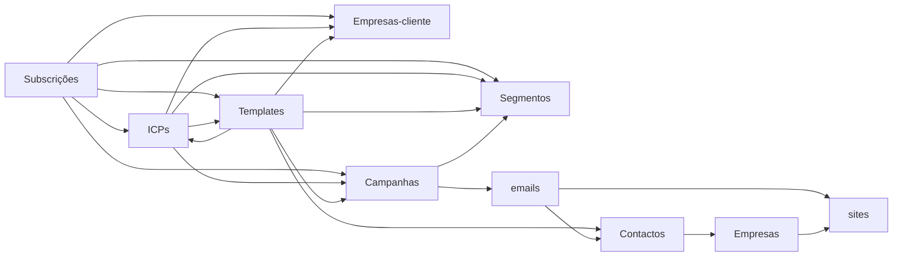

# Modelo comercial / outreach — visão geral

Documenta o que está implementado nas áreas **Subscrições, Contactos, Empresas, ICPs, Templates de
email, Campanhas e Segmentos** do dashboard NetProspect. Um ficheiro por área nesta pasta.

- Dashboard: **np-server** (`http://100.114.17.74:3001`, na tailnet) · SPA em `dashboard/public/index.html`,
  API em `dashboard/server.mjs`.
- Directus (colecções) em `:8056`; Postgres em **np-db** (`100.77.60.44`). Ver [[stack-isolation]].
- Todas as páginas seguem o padrão SPA por hash (`#/<rota>`) + endpoints `/api/<recurso>`.

## Colecções e páginas

| Área | Colecção Directus | Página | Endpoints |
|---|---|---|---|
| Subscrições | `subscriptions` | `#/subscriptions` | `/api/subscriptions` (+ `/:id/campaign`) |
| Públicos-alvo (ICPs) | `icps` | `#/icps` | `/api/icps` |
| Templates de email | `email_templates` | `#/templates` | `/api/email-templates` (+ `/:id/contacts`, `-list`) |
| Campanhas | `campaigns` (+ `emails`) | `#/campaigns` | `/api/campaigns` (+ `/:id/generate`, `/send`) |
| Segmentos | `segments` | `#/segments` | `/api/segments` |
| Contactos | `contacts` | `#/contacts` | `/api/contacts` (+ `-search`, `-by-ids`) |
| Empresas | `companies` | via drawer do site + `#/clients` | `/api/site`, `/api/clients` |

## Relações (como estão modeladas)

**Convenção-chave:** as relações muitos-para-muitos entre estas entidades **NÃO usam tabelas de junção
do Directus** — guardam-se como **arrays de ids em campos `json`** no próprio registo (ex.: uma
subscrição tem `segment_ids: [5,6]`, `icp_ids: [2]`, `template_ids: [3]`). É uma simplificação
deliberada: menos esquema, edição trivial no dashboard, e o front-end resolve os nomes a partir dos
`refs` que cada endpoint de listagem devolve. O custo é não haver integridade referencial ao nível do
Directus (um id apagado fica pendurado até ser re-guardado) — aceitável a esta escala.

Cada endpoint de listagem devolve `{ items|<recurso>, refs: { … } }`, onde `refs` traz as listas
(id+nome) das entidades ligáveis, para os multi-selects e para resolver os nomes.

## Fluxos que atravessam áreas

- **Segmento = audiência.** Um segmento guarda um objeto de filtros do directório (`filters`). Campanhas
  e o "Criar campanha" de uma subscrição usam esses filtros para construir a audiência de contactos.
- **Subscrição → Campanha.** Botão numa subscrição: escolhe um dos seus **segmentos** (audiência) + IA
  (ângulo) **ou** um dos seus **templates** (preenche já os e-mails com `{{variáveis}}`). Ver
  [subscricoes.md](subscricoes.md) e [campanhas.md](campanhas.md).
- **Contactos → Template.** Adicionam-se contactos a um template pela página do template (popup de
  pesquisa) ou a partir do drawer de uma empresa ("+ a template"). Ver [templates.md](templates.md).
- **Variáveis dos templates** bebem do mesmo dataset (contacto+site+empresa) que a geração por IA das
  campanhas usa — `{{name}}`, `{{company}}`, `{{domain}}`, `{{city}}`, `{{industry}}`, `{{seo_score}}`, …
